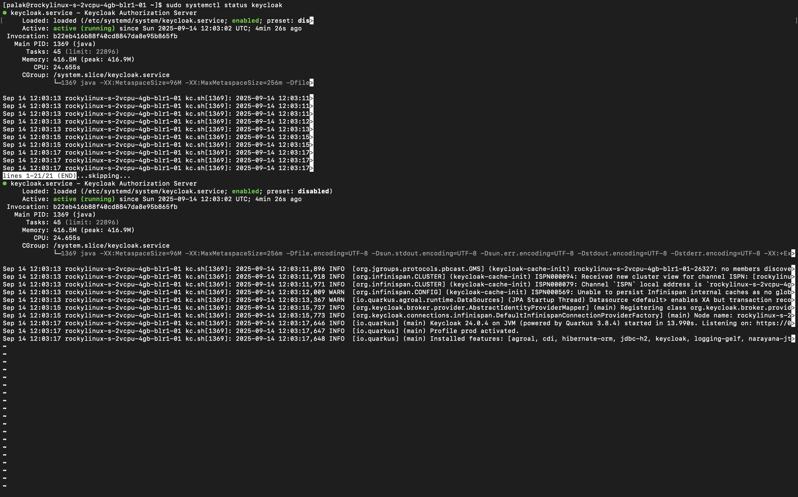
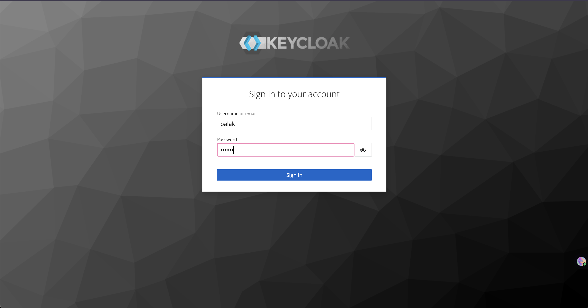
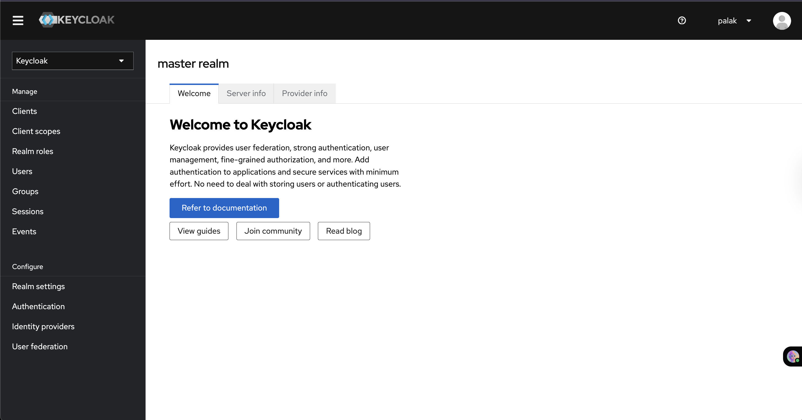

# 02 – Keycloak Setup

This document explains how to install and configure Keycloak on your DigitalOcean server.


## A. Install Java
```bash
# Install OpenJDK 17
sudo dnf install java-17-openjdk-devel -y

# Verify Java installation
java -version
```
## B. Download & Install Keycloak
```bash
cd /opt
sudo wget https://github.com/keycloak/keycloak/releases/download/24.0.4/keycloak-24.0.4.zip
sudo unzip keycloak-24.0.4.zip
sudo mv keycloak-24.0.4 keycloak
```
## C. Create Keycloak User & Permissions
```bash
sudo groupadd keycloak
sudo useradd -r -g keycloak -d /opt/keycloak -s /sbin/nologin keycloak
sudo chown -R keycloak:keycloak /opt/keycloak
```
## D. Start Keycloak (Development Mode)
```bash
/opt/keycloak/bin/kc.sh start-dev --http-port=8080
```
## E. Create Systemd Service for Production

Create the file `/etc/systemd/system/keycloak.service`:

```ini
[Unit]
Description=Keycloak Authorization Server
After=network-online.target
Wants=network-online.target

[Service]
Type=simple
User=keycloak
Group=keycloak
Environment=KEYCLOAK_ADMIN=palak
Environment=KEYCLOAK_ADMIN_PASSWORD=123456
ExecStart=/opt/keycloak/bin/kc.sh start \
  --https-certificate-file=/etc/x509/https/keycloak.crt \
  --https-certificate-key-file=/etc/x509/https/keycloak.key \
  --hostname=139.59.91.6 \
  --hostname-strict=true \
  --http-enabled=false \
  --optimized
Restart=on-failure
RestartSec=30
LimitNOFILE=102400
LimitNPROC=102400
TimeoutStartSec=600

[Install]
WantedBy=multi-user.target
```

```bash
sudo systemctl daemon-reload
sudo systemctl enable --now keycloak
sudo systemctl status keycloak
```

### Screenshot: Keycloak Admin Console
  
*This shows the Keycloak admin console after successful login.*

### Screenshot: Keycloak Admin Login


### Screenshot: Keycloak Admin Console After Login
  
*This screenshot shows the Keycloak master realm dashboard after successful admin login, including Clients, Users, and Realm settings.*

##### Access Keycloak Admin Console

- URL: [https://139.59.91.6:8443/admin/master/console/](https://139.59.91.6:8443/admin/master/console/)
- Username: `palak`
- Password: `123456`

> **Note:** Use the **Advanced** login if prompted.


